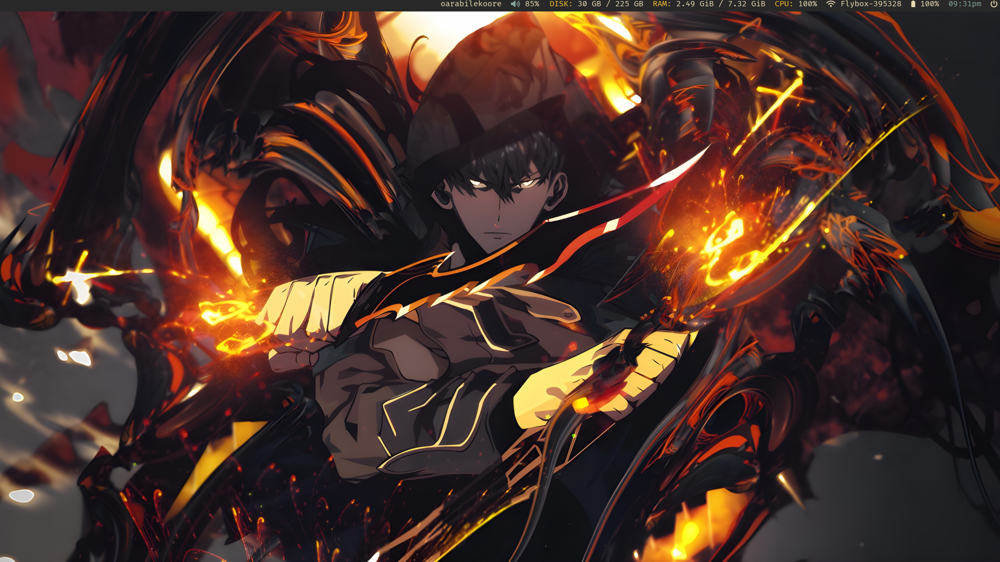

# bspwm.rice CONFIG FILES

Hi, hello here are my dot files and config for my rice.

Things you will need to clone this:

-   picom (built from source) Yshui's Picom Fork
-   rofi
-   polybar
-   sxhkd
-   dunst
-   feh

Nice Ahh pictures;

# License

Tf, this is a rice ofcourse I am using other broski's rice so why think Licensing this is free Af = MIT

For somewhat legal reasons this is under MIT License.
